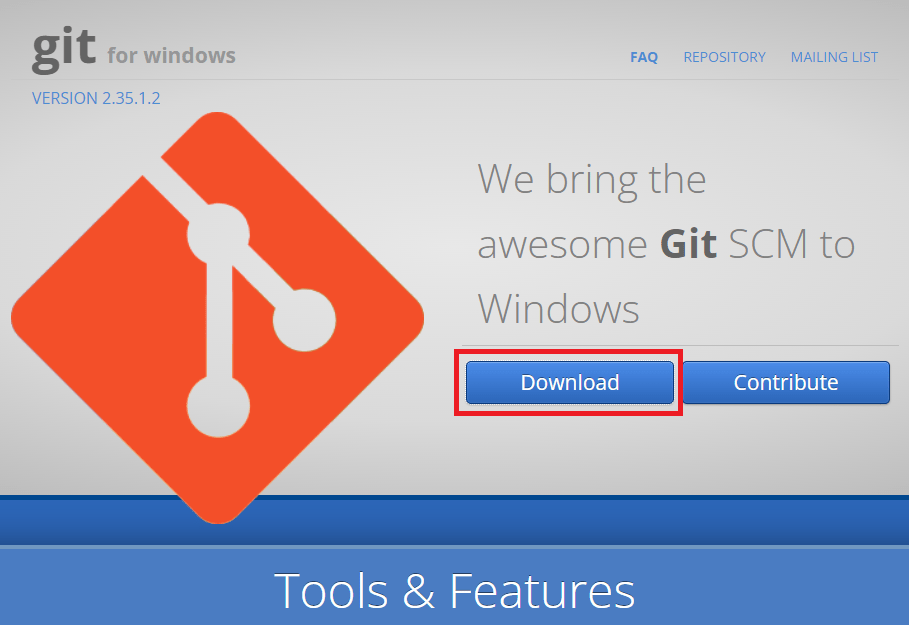
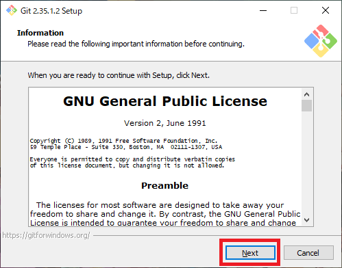
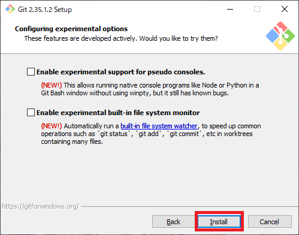
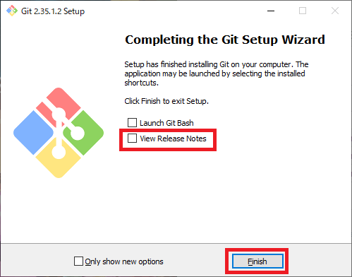

# Git のインストール

## 1. Git のダウンロード

### 1-1. Git for Windows のダウンロードサイトへアクセス
下記URLにアクセスします。  
https://gitforwindows.org/

### 1-2.『Download』を選択
『Download』を選択してください。

## 2. Git のインストール

### 2-1. ダウンロードした『Git-X.XX.X.X-64-bit.exe』を実行
ダウンロードした『Git-X.XX.X.X-64-bit.exe』を実行します。  

**ユーザーアカウント制御**  
「このアプリがデバイスに変更を加えることを許可しますか」と表示される場合は、  
『はい』を選択してください。

### 2-2. インストール
初期設定で問題ないので、ひたすら右下の『Next』を実行  

最後に『Install』が表示されるので、『Install』を選択してください。

### 2-3. インストール完了
インストールが完了すると、『Finish』ボタンが表示されます。  
「View Relases Notes」のチェックを外して『Finish』を選択してください。  
※ 「View Relases Notes」のチェックを外し忘れてもブラウザにリリースノートが表示されるだけなので閉じてください。

## TortoiseGit のインストールへ
先程のインストールだとコマンドプロンプトからしか 「Git」 を使えないので、  
画面で操作できる 『TortoiseGit』をインストールします。

[TortoiseGit のインストールへ](TortoiseGit.md)

## 一覧に戻る
[一覧に戻る](../GitforWindows.md)
