# RPGツクールMZでのGitの簡単な使い方
RPGツクールMZでのGitの簡単な使い方を説明していきます！

* [1. リポジトリ(レポジトリ)の作成](MZ.md#1-リポジトリレポジトリの作成)
* [2. コミットする](MZ.md#2-コミットする)
* [3. コミット後の使い方](MZ.md#3-コミット後の使い方)
* [4. 変更の取り消し](MZ.md#4-変更の取り消し)
* [5. 変更をコミットする](MZ.md#5-変更をコミットする)
* [6. コミット後の変更を元に戻す](MZ.md#6-コミット後の変更を元に戻す)
* [7. あとがき](MZ.md#7-あとがき)

## 1. リポジトリ(レポジトリ)の作成
リポジトリ(Repository)は英語で倉庫という意味です。  
リポジトリを作成することで、作成したフォルダ内のファイルをバージョン管理することができます。

まず、RPGツクールMZ のプロジェクトを用意します。  
新規作成したもので解説していきます。

プロジェクトのフォルダ上で、「右クリック」  
その後に表示される『Git ここにリポジトリを作成(Y)...』を選択してください。

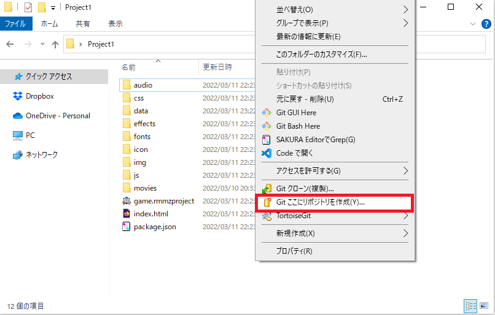

以下メッセージが表示されるので、『OK』を選択  
その後「"パス名" を空のGitレポジトリ」として初期化しました。」と表示されるので、
こちらも『OK』を押します。

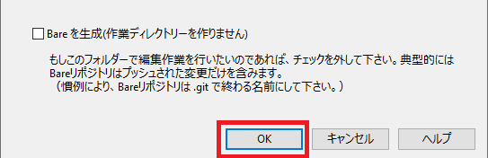

画面上に『.git』フォルダが作成されます。このフォルダがGitのリポジトリとなります。

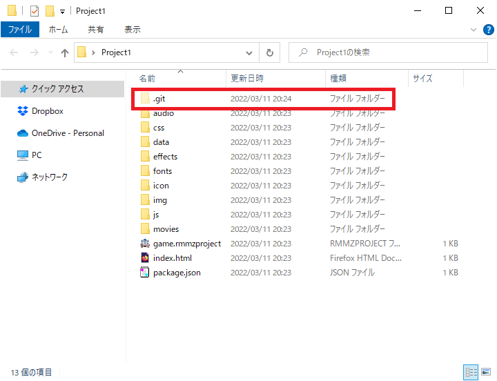

表示されない場合は、エクスプローラーの「表示」タブをクリックし、  
「隠しファイル」のチェックを入れてください。

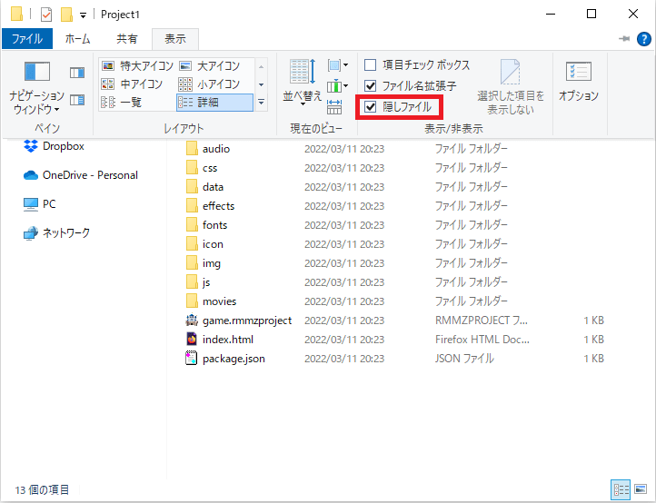

## 2. コミットする
リポジトリに現在のバージョン情報を保存することをコミットといいます。  
ゲームでいうセーブみたいなものです。  
新規プロジェクトの状態をコミットしていきましょう！

リポジトリ(.gitフォルダ)がある所で「右クリック」を実行します。  
『Git コミット(C) -> "master"...』を選択します。

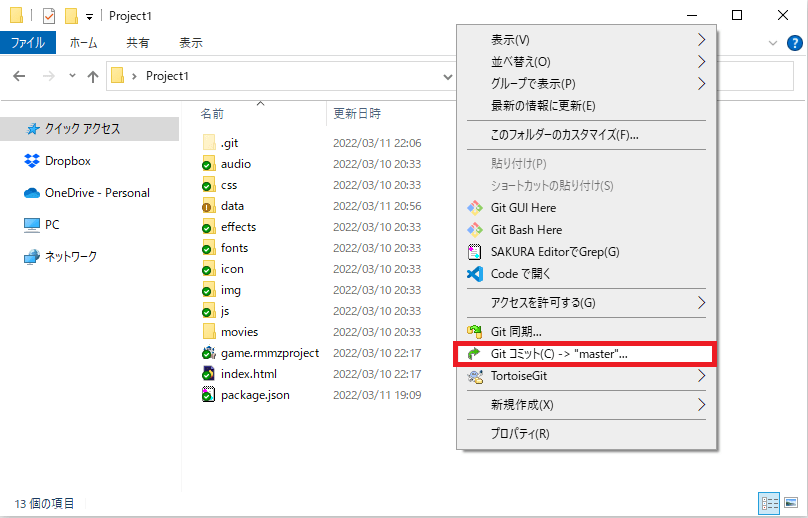

以下のような画面が表示されるので、参考にコミットしましょう！

1. メッセージに『新規プロジェクト作成(RPGツクールMZバージョン1.4.4)』と入力
2. 『すべて(A)』をクリックし、チェックを入れます。
3. 『コミット(O)』をクリックするとコミットが始まります。プロジェクトの全体をコミットするので少し時間がかかります。
4. 終わったら、『閉じる』ボタンを押して終了してください。

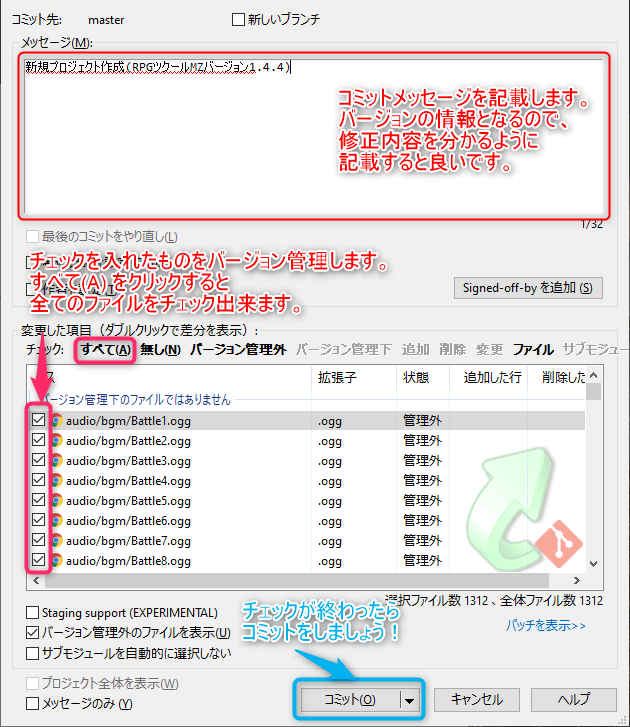

## 3. コミット後の使い方
コミットが終わったら、作業を進めていきます。  
今回はアクターにドラゴンを追加して、プロジェクトを保存してください。

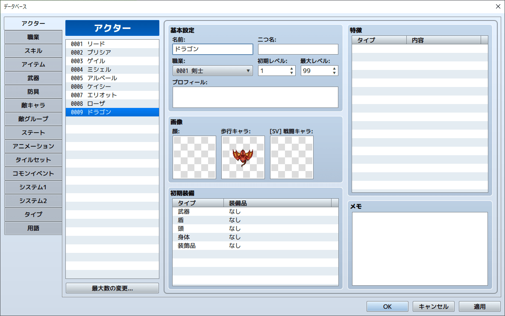

保存後、プロジェクトのフォルダを開くと 『dataフォルダ』 が赤く「！」マークが表示されます。  
この赤い部分は、前回のコミットからの差分があることを表しています。  
緑の「チェック」マークは、バージョン管理されているファイルを表します。

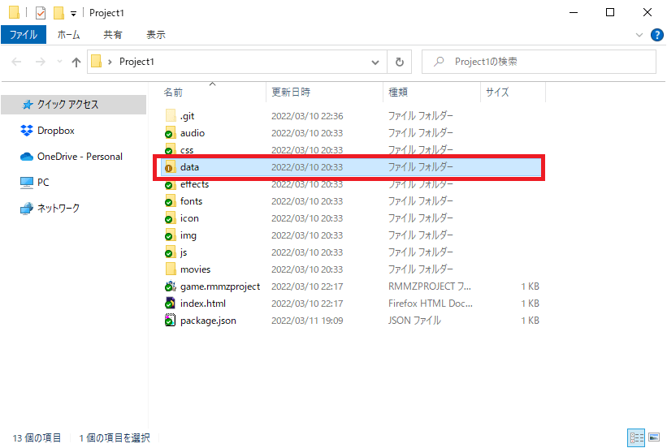

data フォルダ内を見ると、「Actors.json」と「System.json」が変更されていることが分かります。  
「System.json」は、プロジェクトの保存をすると、versionId(58193840 のようなランダムな数字)が書き換わるため変更されています。

「System.json」はそのままで問題ないですが、  
「TortoiseGit」の使い方を覚えるために「変更の取り消し」で変更を取り消してみましょう！

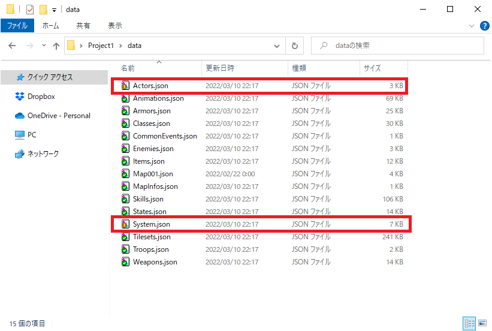

## 4. 変更の取り消し
『data』フォルダ上で右クリックし、「TortoiseGit」 > 『変更の取り消し(V)』を選択します。

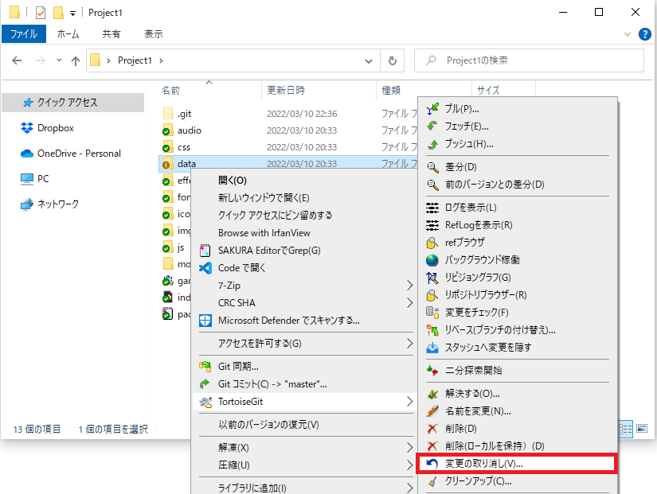

「data/System.json」の左にチェックを入れ、『OK』を選択します。

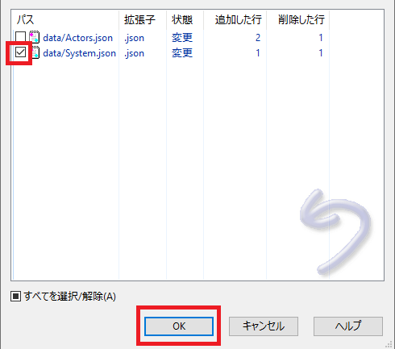

続いて『OK』を選択します。  
これで「System.json」の変更はなかったことに出来ます。

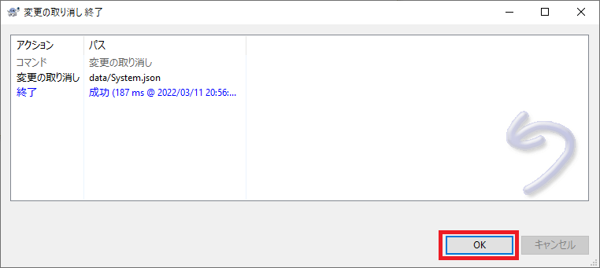

## 5. 変更をコミットする
リポジトリ(.gitフォルダ)がある所で「右クリック」を実行します。  
『Git コミット(C) -> "master"...』を選択します。

1. メッセージに『アクター: ドラゴン追加』と入力
2. 『コミット(O)』をクリックするとコミットが始まります。今回は差分のみコミットするので時間はあまりかかりません。
3. 終わったら、『閉じる』ボタンを押して終了してください。

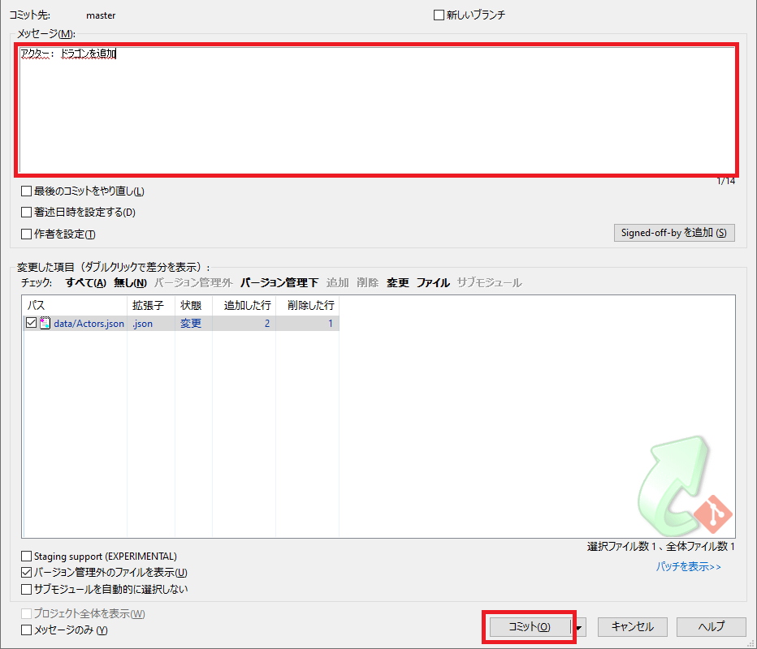

## 6. コミット後の変更を元に戻す
コミット後の変更を元に戻す方法は、色々ありますが一番リスクが少ない方法を教えておきます。

リポジトリ(.gitフォルダ)がある所で「右クリック」を実行します。    
「TortoiseGit」 > 『前のバージョンとの差分(D)』を選択します。

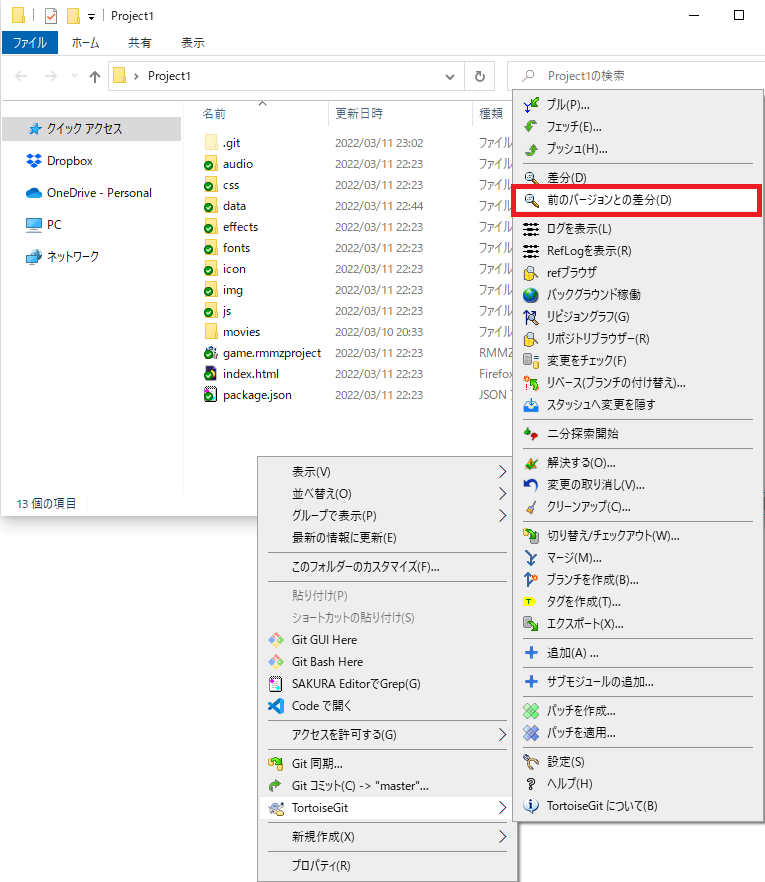

「data/Actors.json」上で右クリックを実行し、『赤枠で囲った部分』を選択します。  
続いて表示される画面で「OK」を押すとドラゴンの追加をなかったことに出来ます。

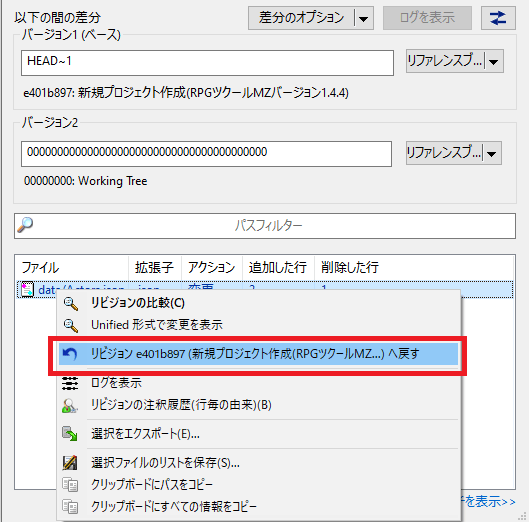

## 7. あとがき
簡単な使い方で紹介したようにコミットを繰り返すことでバージョン管理を実現します。  
Git が必要なくなった場合は、「.git」フォルダを削除すればOKです。

ここで紹介したものは Git のほんの一部の機能です。  
後は色々調べながら使ってみてください。

## TortoiseGit のインストールへ(前のページに戻る)
[TortoiseGit のインストールへ](TortoiseGit.md)

## 一覧に戻る
[一覧に戻る](../GitforWindows.md)
