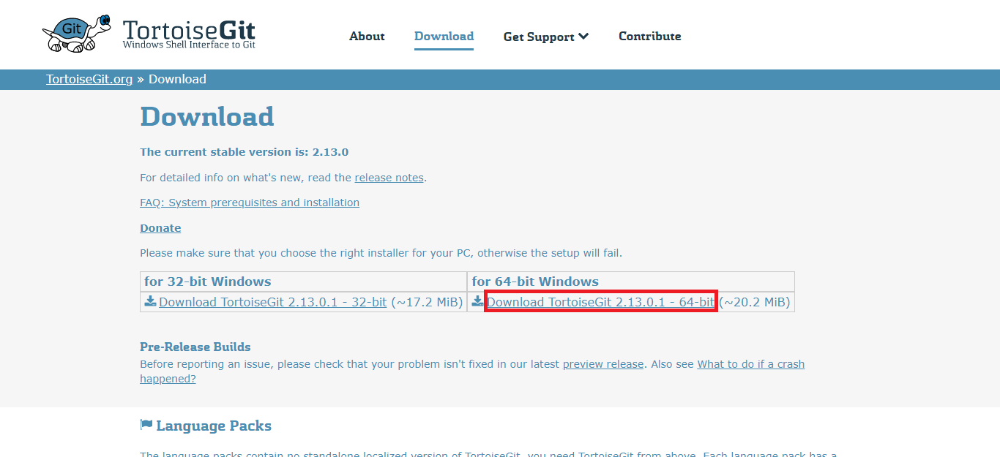

# TortoiseGit のインストール
先程のインストールだとコマンドプロンプトからしか 「Git」 を使えないので、  
画面で操作できる 『TortoiseGit』をインストールします。

## 0. インストール前の注意点
『TortoiseGit』は 「亀(Tortoise)」 の名の通り「賢者ギード」のように有能ですが、  
インストール中の「エクスプローラー」終了処理が上手くいかないことがあり、  
インストールが終わってもPCが真っ暗な画面のまま復帰しないことがあります。

対策方法を記載しておくので、  
「エクスデス」のように「カメェェェッー！」と言わなくて済むように  
スマホ等で別画面で対策方法を表示するか、紙にメモを取るようにお願いします。

### 0-1. 対策方法
1. Ctrl + Alt + Delete キーの3つを全て同時に押します。
2. 画面中央に選択肢が表示されるので「タスクマネージャー」を選択  
※ 以下のような画面が表示されます。
3. 赤枠の「エクスプローラー」上で右クリックを選択、『再起動(R)』を選択  
=> こちらを実施すると画面が元に戻ります。

※ どうしても分からなければ、PCの電源ボタンを押して強制シャットダウンし、PCを再起動してください。  
(こちらは最終手段として使ってください)

## 1. TortoiseGit のダウンロード

### 1-1. TortoiseGit のダウンロードサイトへアクセス
下記URLにアクセスします。  
https://tortoisegit.org/download/

### 1-2.『Download TortoiseGit X.XX.X.X - 64-bit』を選択
『Download TortoiseGit X.XX.X.X - 64-bit』を選択してください。

### 1-3.『Setup』を選択(日本語化に必要)
画面下の方に「Language Packs」があるので、  
「Japanese」の赤枠の場所の『Setup』を選択してください。

## 2. TortoiseGit のインストール

### 2-1. ダウンロードした『TortoiseGit-X.XX.X.X-64bit.msi』を実行
ダウンロードした『TortoiseGit-X.XX.X.X-64bit.msi』を実行します。  

### 2-2. インストール
初期設定で問題ないので、ひたすら右下の『Next』を実行

最後に『Install』が表示されるので、『Install』を選択してください。

**ユーザーアカウント制御**  
「このアプリがデバイスに変更を加えることを許可しますか」と表示される場合は、  
『はい』を選択してください。

### 2-3. インストール完了
インストールが完了すると、『Finish』ボタンが表示されます。  
「Run first start wizard」のチェックを外して『Finish』を選択してください。  
※ 「Run first start wizard」のチェックを外し忘れたら、次に起動する画面で『キャンセル』を選択してください。

## 3. TortoiseGit の日本語化

### 3-1. ダウンロードした『TortoiseGit-LanguagePack-X.XX.X.X-64bit-ja.msi』を実行
ダウンロードした『TortoiseGit-LanguagePack-X.XX.X.X-64bit-ja.msi』を実行します。  

### 3-2. 『次へ(N)』を実行
『次へ(N)』を実行

**ユーザーアカウント制御**  
「このアプリがデバイスに変更を加えることを許可しますか」と表示される場合は、  
『はい』を選択してください。

### 3-3. インストール完了
インストールが完了すると、『完了(F)』ボタンが表示されます。  
「Configure TortoiseGit to use this language」のチェックを入れて『完了(F)』を選択してください。  
※ 「Configure TortoiseGit to use this language」のチェックを入れ忘れても後で設定できます。

## 4. TortoiseGit の初期設定

### 4-1. 初期設定ウィザードを再実施
1. デスクトップ上で、右クリック
2. 「TortoiseGit」 > 「設定(S)」 を選択
3. 『初期設定ウィザードを再実施』を選択

### 4-2. 言語設定
日本語になっているはずですが、なっていなければ日本語に設定し、『次へ(N)』を選択

### 4-3. 説明
『次へ(N)』を選択

### 4-4. Git のパス設定
1.『C:\Program Files\Git\bin』のように [Git インストール](Git.md) でインストールしたパスが指定されていればOK  
2. 設定したら『次へ(N)』を選択

### 4-5. Git の名前とメール設定
1. 名前とメールを設定します。メールを送信したりするわけではないので、架空のメールアドレスでもOK。  
2. 設定したら『次へ(N)』を選択

### 4-6. リモート用の設定
変更の必要はないので、『完了』を選択

## RPGツクールMZでのGitの簡単な使い方へ
RPGツクールMZでのGitの簡単な使い方を説明していきます！  
※ こちらは作成中です。もう少しで出来るので待っていてください。

[RPGツクールMZでのGitの簡単な使い方へ](MZ.md)

## Git のインストールへ(前のページに戻る)
[Git のインストールへ](Git.md)

## 一覧に戻る
[一覧に戻る](../GitforWindows.md)
