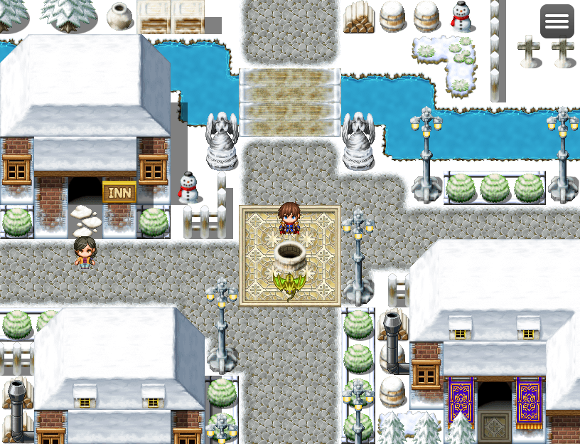

# ワールド自動生成プラグイン ～スノーイベント～

## 概要

|概要|説明|
|---|---|
|イベント名|ワールド自動生成プラグイン ～スノーイベント～|
|イベント内容|ワールド自動生成プラグインを利用した催しです！|
|主催者|ポテトードラゴン  RPGツクールMZプラグイン制作者 ワールド自動生成プラグインという大規模プラグインを作成中！  作成したプラグインは以下からダウンロード出来ます。 https://github.com/pota-gon/RPGMakerMZ/wiki|
|開催日|2021/12/31(金) ～ 2022/3/31(木)|
|参加費|無料（ニコニコ動画の会員登録が別途必要）|
|開催場所|ワールド生成テスト（ゲームアツマール） https://game.nicovideo.jp/atsumaru/games/gm22870  ゲームアツマールを初めて使う方向けの『[ゲームアツマール講座](https://github.com/pota-gon/MZAtsumaru/wiki)』を 公開しておりますので、必要に応じて参照ください。|

## 参加特典
参加特典として雪が降るプラグイン 『Snow.js』 をプレゼント！！  
※ 参加特典は、井戸の前にいるポテトードラゴンさんに話しかけると貰えます！

## イベントについて
簡単なイベントをクリアするとプラグインを先行入手出来ます！  
イベント期間中に参加・クリア出来なくても、イベント終了後、下記サイトで配布予定ですので、ご安心ください。  
https://github.com/pota-gon/RPGMakerMZ/wiki

### ツイートや実況について
ツイッターの投稿やスクショを利用したツイートなどご自由に実施ください。  
実況などもご自由に実施してください!  
制作者への報告は任意です。
