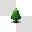
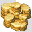

# A1

|画像|番号|タイル名|
|-|-|-|
||2048|海|
||2096|深い海|
||2144|岩礁|
||2192|氷山|
||2240|毒の沼|
||2288|枯れ木|
||2336|溶岩|
||2384|溶岩の泡|
||2432|池|
||2480|岩|
||2528|凍った海|
||2576|渦|
||2624|大地の境界|
||2672|下界に落ちる滝|
||2720|雲（大地の境界）|
||2768|雲|

# A2

|画像|番号|タイル名|
|-|-|-|
||2816|草原A|
||2864|草原A（濃）|
||2912|草原B|
||2960|草原B（濃）|
||3008|森|
||3056|森（針葉樹）|
||3104|山（草）|
||3152|山（土）|
||3200|荒れ地A|
||3248|荒れ地B|
||3296|土肌A|
||3344|土肌B|
||3392|森（枯れ木）|
||3440|道（土）|
||3488|丘（土）|
||3536|山（砂岩）|
||3584|砂漠A|
||3632|砂漠B|
||3680|岩地A|
||3728|岩地B（溶岩）|
||3776|森（ヤシの木）|
||3824|道（舗装）|
||3872|山（岩）|
||3920|山（溶岩）|
||3968|雪原|
||4016|山（雪）|
||4064|雲|
||4112|大きな雲|
||4160|森（雪）|
||4208|穴|
||4256|丘（砂岩）|
||4304|丘（雪）|
