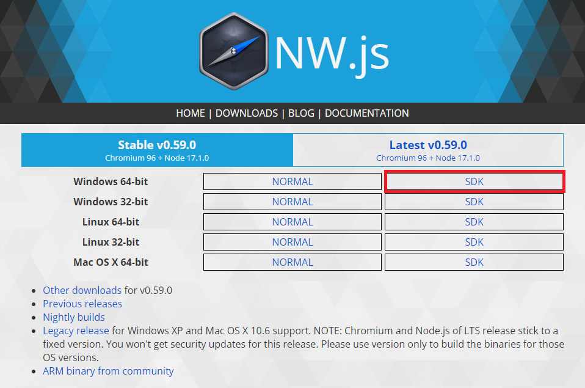
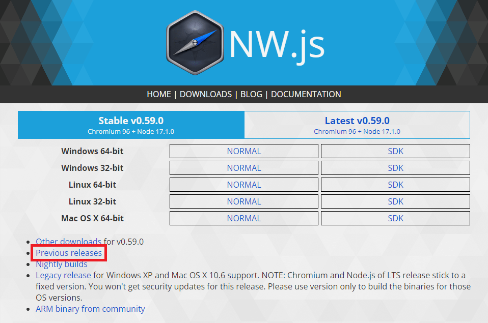
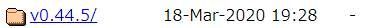

# RPGツクールMZで NW.js が残り続ける問題の解決方法
RPGツクールMZ でゲーム開発していると、時々重くなることがあります。  
タスクマネージャーを開いてみると大量の NW.js が起動したままとなっています。

NW.js のバージョンが原因と推測されるため、  
NW.js の差し替え方法について説明します。

|RPGツクールMZバージョン|NW.jsバージョン|報告されている問題|
|---|---|---|
|1.0.0 ～ 1.1.1|0.44.5|(1) M1チップ搭載のMac機種にて強制終了する (2) Big Surにて画面が表示されなくなる|
|1.2.0|0.51.0|NW.js が残り続ける|
|1.2.1 ～ 1.5.0|0.48.4|NW.js が残り続ける macOS 11(Big Sur)以降のMacにおいて動作が不安定になる(2024年10月23日現在最新版である0.93.0は、Big Sur以降のmacOSにおいてより安定して動作)|
|1.6.0|0.69.1|一部の環境で「テストプレイ」「バトルテスト」「デプロイメントしたアプリ」が起動しない macOS10.15以前(node.js v18.10.0 になったことが原因)|
|1.6.1 ～ 1.8.1|0.48.4|NW.js が残り続ける|

## Macの手順について
Macの手順については、公式様より手順が公開されています。  
https://rpgtkool.hatenablog.com/entry/2024/10/23/140944

以下、目次から確認したい項目を選択してください

|目次|備考|
|---|---|
|[NW.jsを最新版へ差し替え](#nwjsを最新版へ差し替え)|最新版に差し替えたい場合、こちらを確認してください。|
|[NW.jsを旧バージョンに差し替え](#nwjsを旧バージョンに差し替え)|NW.js が残り続ける問題が発生する前のバージョンに差し替える方法を説明します。|
|[プロフィールエラーの解消について](#プロフィールエラーの解消について)|差し替え後、エラーが出る場合確認してください。|

---

## NW.jsを最新版へ差し替え
NW.jsを最新版へ差し替える方法を説明します。

### 1. NW.js のダウンロードサイトへアクセス
下記URLにアクセスします。  
https://nwjs.io/downloads/

### 2.『SDK』を選択
『SDK』を選択してください。

### 3. 差し替えるフォルダをバックアップ
以下のフォルダをバックアップしておいてください。  
もし、忘れた場合でも再度、RPGツクールMZ を再インストールすれば、元に戻せます。

* ストア版: C:\Program Files\KADOKAWA\RPGMZ\nwjs-win
* Steam版: C:\Program Files (x86)\Steam\steamapps\common\RPG Maker MZ\nwjs-win

### 4. ダウンロードしたZIPファイルを解凍
ダウンロードしたZIPファイルを解凍します。

### 5. 解凍したフォルダ名称を変更します
解凍したフォルダ名称を以下のように変更してください。

* 『nwjs-sdk-v0.59.0-win-x64』 => nwjs-win

### 6. フォルダを差し替え
以下のフォルダを差し替えてください。これで完了です。

* ストア版: C:\Program Files\KADOKAWA\RPGMZ\nwjs-win
* Steam版: C:\Program Files (x86)\Steam\steamapps\common\RPG Maker MZ\nwjs-win

---

## NW.jsを旧バージョンに差し替え
ここでは、NW.js が残り続ける問題のなかった 『0.44.5』への差し替え方法を説明します。

### 1. NW.js のダウンロードサイトへアクセス
下記URLにアクセスします。  
https://nwjs.io/downloads/

### 2.『Previous releases』を選択
『Previous releases』を選択してください。  

### 3. 『v0.44.5』を選択
『v0.44.5』を選択してください。

### 4. 以下ファイルをダウンロード
* 『nwjs-sdk-v0.44.5-win-x64.zip』

### 5. 差し替えるフォルダをバックアップ
以下のフォルダをバックアップしておいてください。  
もし、忘れた場合でも再度、RPGツクールMZ を再インストールすれば、元に戻せます。

* ストア版: C:\Program Files\KADOKAWA\RPGMZ\nwjs-win
* Steam版: C:\Program Files (x86)\Steam\steamapps\common\RPG Maker MZ\nwjs-win

### 6. ダウンロードしたZIPファイルを解凍
ダウンロードしたZIPファイルを解凍します。

### 7. 解凍したフォルダ名称を変更します
解凍したフォルダ名称を以下のように変更してください。

* 『nwjs-sdk-v0.44.5-win-x64』 => nwjs-win

### 8. フォルダを差し替え
以下のフォルダを差し替えてください。これで完了です。

* ストア版: C:\Program Files\KADOKAWA\RPGMZ\nwjs-win
* Steam版: C:\Program Files (x86)\Steam\steamapps\common\RPG Maker MZ\nwjs-win

---

## プロフィールエラーの解消について
テストプレイ時に 『プロフィールエラーが発生しました。』 が出る場合は、以下フォルダを削除してください。  
※ ユーザ名は、パソコンの設定内容によって異なるので、適宜変更してください。

C:\Users\ユーザ名\AppData\Local\rmmz-game
